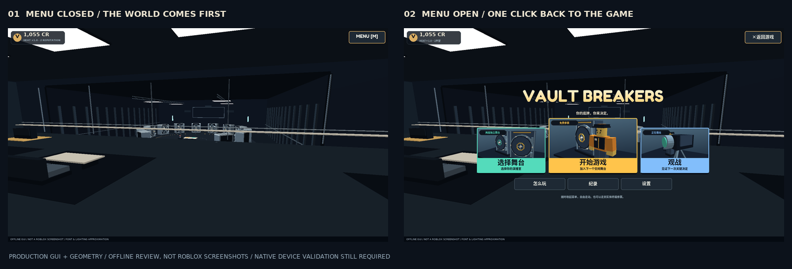
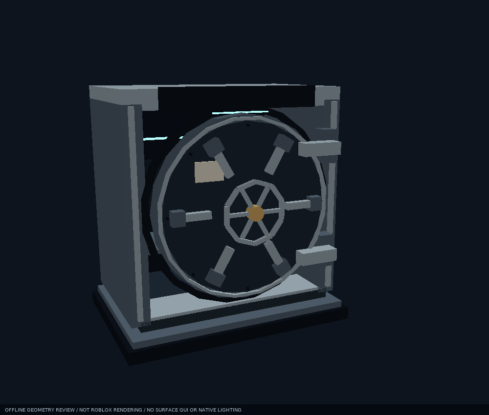

# Vault Breakers｜优化、加固与可收起菜单

**保持原目标，重做承载它的实现。**

最新的节目演出、社交、v3 档案及纯外观扩展见 [本轮交付](本轮交付.md)。

这一轮已经实际修改了 Roblox 项目的源码、场景构建、交互和界面，并重建工程文件。核心仍然是：选手面对未知底牌，在观众的意见和倒计时中决定何时离场，而不是新增一套商城或把玩法做成纯 GUI。

## 先打开什么

| 交付 | 位置 |
|---|---|
| 新版 Roblox 工程 | [VaultBreakers.rbxl](../VaultBreakers.rbxl) |
| 源码与运行说明 | [README](../README.md) / `src/` |
| 原生验收清单 | [Studio QA](STUDIO_QA.md) |
| 设计取舍与技术细节 | [设计说明](DESIGN.md) |
| 图标、概念图、标记与 9 个 WAV | [美术资源说明](../art/README.md) |

在 Studio 打开 `VaultBreakers.rbxl` 后点击 **Play**，舞台会在运行时生成。`Place1.rbxl` 是原仓库旧文档容器，不是新版入口。

> **交付边界：** 当前环境没有 Roblox Studio。新版包已经过结构与嵌入源码校验，代码已通过下述自动化检查；但还不能称为「已在 Studio/手机验收的发布版本」。请先在测试体验按 QA 清单验证，不要直接覆盖生产存档或发布给全部玩家。

## 1. 菜单重做：先进入世界，再按需打开

根据反馈，取消了常驻的网页式大厅、横跨屏幕的大顶栏和全屏渐暗底板。**进入游戏时默认收起菜单，场景才是主画面。**

- 按 M / 右上角按钮即可呼出、收起；手柄方向键上打开，B 回到游戏。
- 换成更具游戏感的粗体标题、厚边框、彩色按钮和 **选择舞台 / 开始游戏 / 观战** 三张原生 3D 缩略图卡片。主入口最大，帮助/纪录/设置退到第二层级。
- 所有子页面可直接关闭回游戏；「返回菜单」与「关闭」不再混为一谈。关闭只改变本地 UI，不退出舞台，不移走角色，也不锁住移动。
- 开始/观战立即收起；普通同步、返回大厅不会重开。排队时保留小型候场状态，可收起菜单继续活动。
- 对局中打开菜单不会暂停服务器倒计时，会显示实时提醒；物理提示与决策快捷键被屏蔽，收起后恢复。
- 保留个人纪录、本服纪录、最近复盘和设置入口；没有借参考图引入商城、库存、任务或货币系统。

**下图是从生产 GUI 和菜单几何生成的离线状态对照，不是 Roblox 截图。文字、光照和背景视角仍为近似；原生安全区、输入、字体和材质须在 Studio/设备确认。**

[桌面菜单大图](review/lobby-desktop.png) · [竖屏菜单](review/menu-mobile.png) · [矮横屏菜单](review/menu-landscape.png)

## 2. 金库与演播室真的重建了

- 金库有中空舱体、内壁、深度、双层圆门、铰链、锁栓/套筒、手轮、铆钉、铭牌和内侧灯带。
- 开门先收锁栓、转手轮，再让整扇门绕铰链旋转，不再只是让一个方块消失。
- Main 与 Quick 是两套独立场地；有 Curator 屏、观众意见屏、实体双按钮和可操作的求助杆。
- 加入灯架、摄影机、吸音墙、标识、玻璃高台、真实座位、桌几和饮品台，形成演播室而不是散落在空地上的金库。
- 每局结束会还原门、锁栓、手轮、杆、标签和粒子；旧延迟动画不能串进下一局。

**以下只展示从真实构建坐标得到的几何检查；没有 Roblox 的 SurfaceGui、材质效果、阴影或原生光照。**

[查看整座主舞台的离线几何检查](review/stage-geometry.png)

## 3. 体验链路补齐

| 关键问题 | 现在的处理 |
|---|---|
| 开门被误解为获得奖励 | 明确写「排除」，奖池划线，开门不增加 Credits |
| 走不到最终二选一 | 排除节奏补齐为 4 / 3 / 2 / 1，真正留下两扇门 |
| 多人争抢、串场 | 服务端控制身份/阶段/距离，两套独立状态机 |
| 观众与选手混淆 | 各自不同的角色文案、按钮权限和免费意见统计 |
| 只能站着等主舞台 | 独立 Quick 场与偏好队列；重开不插队 |
| 等太久/重复输入卡局 | 自动 PUSH/KEEP、AFK/重生/断线释放、阶段编号、限流 |
| 用最后运气评价决定 | 只用当时的报价和剩余奖池评分；本局倍率锁定 |
| 复盘还没看完就消失 | 舞台按时释放，选手继续看复盘；本会话可重新查看 |
| 数据失败却看起来保存成功 | 临时模式与保存延迟提示；失败加载不覆盖已有档案 |
| 假的「全服成绩」 | 只登记本服务器真实完成的基础奖励，榜单最多 8 条 |

手机界面也单独处理了：主要选项至少 44px 高，矮横屏的奖池和按钮分开，触屏返回移到顶栏，不把退出按钮放在移动摇杆位置。极矮可用区域另有左右分栏兜底。

[竖屏报价布局检查](review/offer-mobile.png) · [横屏触摸布局检查](review/offer-landscape.png)

## 4. 第二轮：先让多人边界稳定

这轮没有添加商城或新玩法，而是先编写回归，实际复现了 **9 组此前未覆盖的失败**，再修复并扩大测试：

- **投票与超时：** 切场/回大厅/成为另一场选手时撤回旧票；服务端先处理时钟再接收选择，过期请求不能抢到旧报价。
- **死亡与重连：** 死亡或 CharacterRemoving 即释放舞台；加载中离开、退出保存中重连不会让旧回调删掉新档案。每次加入都有独立存档锁。
- **同步与复盘：** 客户端消费场次、阶段、修订号和 Directory 序号；缺少最新快照时显示等待卡而不是旧局面。重复消息不重开已关闭复盘，也不解锁另一场的待确认操作。
- **镜头与输入：** 镜头目标晚到/CurrentCamera 替换可恢复；弹窗立即关闭物理提示，关闭后恢复权限。新复制到达的提示/属性不依赖下一阶段才生效。
- **原生验收入口：** 新增只读 `StudioChecks.run()`，在 Studio 中读出场景结构、文字 TextBounds、固定按钮安全区与交互尺寸问题。当前环境仅检查了该工具的逻辑，没有生成原生验收结果。

`ClientMain` 的弹窗动作、等待卡与 RenderStepped 重试已进入入口级测试，不只是孤立的控制器测试。边界套件也已加入 `npm test` / CI 配置。

## 5. 补充美术与声音

交付了方形金库图标、横版演播室概念图、可编辑 SVG 标记，以及 9 个原创程序合成的机械/广播/悬疑 WAV。营销图明确属于 **AI 生成概念美术，不是游戏运行截图**。

运行不依赖这些图片。当前已有 7 个不同的合作方库音频 ID，来源清单已核对但未实播；原创 WAV 可通过 AssetConfig.OriginalUploads 覆盖。具体权限/听感边界见本轮交付与美术说明。

## 6. 已验证与未验证

| 检查 | 本地结果 |
|---|---|
| 生产 Luau 编译 | 47 个文件通过（非静态类型检查） |
| 纯规则回归 | 21 组通过，含 1,000 次确定性完整对局 |
| 纯客户端状态回归 | 7 组通过 |
| 入口 / 场景 / 客户端 / 布局契约 | 16 组通过 |
| 异步 / 生命周期 / 输入边界回归 | 17 组通过 |
| 菜单交互、输入与布局 | 9 组通过 |
| 节目/进度纯逻辑 + 新入口契约 | 10 + 16 组通过；共 96 组回归 |
| 工程结构与嵌入源码 | 61 个服务/文件夹/脚本节点，47 个源码逐一匹配 |
| 音频文件 | 9 个 WAV 的格式、长度、峰值余量与哈希通过 |

场景在 doubles 中构建得到 2,729 个 BasePart、12 个 Seat、26 个灯对象；菜单另外有 205 个按需创建、缓存复用的本地缩略图零件。这只是对象预算检查，**不等于性能成绩**。

还需要 Studio/真机确认的重点是：原生 place 加载、中文与长名字排版、灯光和材质、门/角色碰撞、相机遮挡、触屏安全区/手柄焦点、真实多人复制、音频权限和真实 DataStore 的保存与冲突行为。

完整清单已经写在 [STUDIO_QA.md](STUDIO_QA.md)。建议先做 **3 客户端主/快速场并行测试**，再做一轮 **6–8 人真人试玩**；这比继续增加无关系统更值得优先投入。
